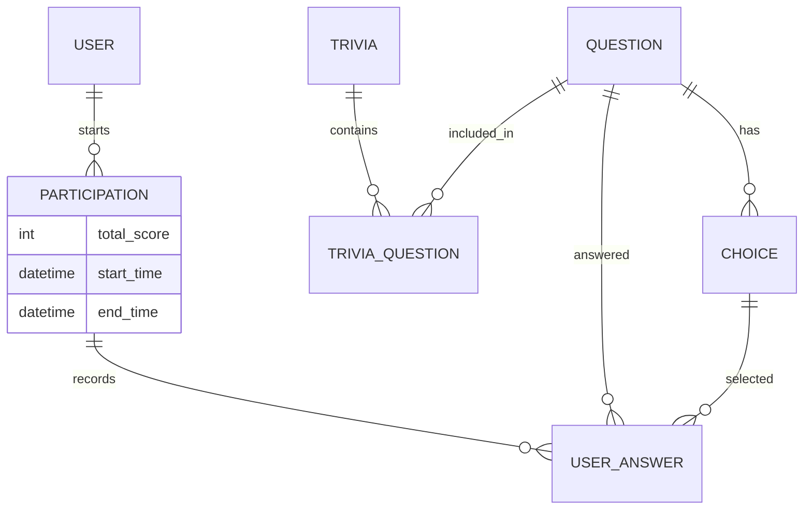

# 🚀 Talatrivia API

## 🌟 Project Overview

This repository contains the solution for the **Talana Technical Challenge**. It is a high-performance, scalable Trivia API built with **Django Rest Framework**.

### 🎯 The Mission
To build a trivia system where users can:

1. Participate in varied trivias.
2. Score points based on question difficulty (Easy: 1, Medium: 2, Hard: 3).
3. Compete in a global ranking where Time is the tie-breaker.

---

## 🛠️ Architecture & Tech Stack

| Technology | Justification |
| --- | --- |
| **Python 3.10 + Django** | Proven stability and rapid development for complex relational logic. |
| **DRF (Django Rest Framework)** | Industry standard for robust, self-documented APIs. |
| **PostgreSQL** | Robustness for ACID transactions (critical for scoring and participation integrity). |
| **Service Layer Pattern** | Business logic (like score calculation) is decoupled from Views into `Services`, making it 100% testable and reusable. |
| **Docker + Makefile** | Ensures "it works on my machine" is "it works everywhere". Zero-conf bootstrap. |
| **Poetry** | Deterministic dependency management, far superior to `requirements.txt`. |

---

## 📊 Database Schema (ERD)



---

### 📂 Project Structure

```bash
├── apps
│   ├── conftest.py
│   ├── core
│   │   ├── apps.py
│   │   ├── __init__.py
│   │   └── views.py
│   ├── __init__.py
│   ├── questions
│   │   ├── admin.py
│   │   ├── admins
│   │   │   ├── choice_admin.py
│   │   │   ├── __init__.py
│   │   │   └── question_admin.py
│   │   ├── apps.py
│   │   ├── enums
│   │   │   ├── difficulty_level.py
│   │   │   └── __init__.py
│   │   ├── __init__.py
│   │   ├── models
│   │   │   ├── choice.py
│   │   │   ├── __init__.py
│   │   │   └── question.py
│   │   ├── serializers
│   │   │   ├── choice_serializer.py
│   │   │   ├── __init__.py
│   │   │   └── question_serializer.py
│   │   ├── tests
│   │   │   ├── conftest.py
│   │   │   ├── factories.py
│   │   │   ├── __init__.py
│   │   │   ├── test_models.py
│   │   │   ├── test_serializers.py
│   │   │   ├── test_validations.py
│   │   │   └── test_views.py
│   │   ├── urls.py
│   │   └── views
│   │       ├── choice_viewset.py
│   │       ├── __init__.py
│   │       └── question_viewset.py
│   ├── trivias
│   │   ├── admin.py
│   │   ├── admins
│   │   │   ├── __init__.py
│   │   │   ├── participation_admin.py
│   │   │   └── trivia_admin.py
│   │   ├── apps.py
│   │   ├── __init__.py
│   │   ├── models
│   │   │   ├── __init__.py
│   │   │   ├── participation.py
│   │   │   ├── trivia.py
│   │   │   ├── trivia_question.py
│   │   │   └── user_answer.py
│   │   ├── serializers
│   │   │   ├── answer_input_serializer.py
│   │   │   ├── __init__.py
│   │   │   ├── participation_serializer.py
│   │   │   ├── ranking_serializer.py
│   │   │   ├── trivia_serializer.py
│   │   │   └── user_answer_serializer.py
│   │   ├── services
│   │   │   ├── __init__.py
│   │   │   └── participation_service.py
│   │   ├── tests
│   │   │   ├── conftest.py
│   │   │   ├── factories.py
│   │   │   ├── __init__.py
│   │   │   ├── test_integrations.py
│   │   │   ├── test_models.py
│   │   │   ├── test_permissions.py
│   │   │   ├── test_serializers.py
│   │   │   ├── test_services.py
│   │   │   └── test_views.py
│   │   ├── urls.py
│   │   └── views
│   │       ├── __init__.py
│   │       ├── participation_viewset.py
│   │       ├── ranking_view.py
│   │       ├── trivia_viewset.py
│   │       └── user_answer_viewset.py
│   └── users
│       ├── admin.py
│       ├── admins
│       │   ├── __init__.py
│       │   └── user_admin.py
│       ├── apps.py
│       ├── enums
│       │   ├── __init__.py
│       │   └── user_role.py
│       ├── __init__.py
│       ├── managers
│       │   ├── __init__.py
│       │   └── user_manager.py
│       ├── models
│       │   ├── __init__.py
│       │   └── user.py
│       ├── serializers
│       │   ├── __init__.py
│       │   ├── login_serializer.py
│       │   ├── me_serializer.py
│       │   ├── token_serializer.py
│       │   └── user_serializer.py
│       ├── services
│       │   ├── auth_service.py
│       │   └── __init__.py
│       ├── tests
│       │   ├── conftest.py
│       │   ├── factories.py
│       │   ├── __init__.py
│       │   ├── test_auth_endpoints.py
│       │   ├── test_models.py
│       │   ├── test_permissions.py
│       │   ├── test_serializers.py
│       │   ├── test_services.py
│       │   ├── test_validations.py
│       │   └── test_views.py
│       ├── urls.py
│       └── views
│           ├── auth_viewset.py
│           ├── __init__.py
│           └── user_viewset.py
├── config
│   ├── asgi.py
│   ├── env.py
│   ├── __init__.py
│   ├── settings
│   │   ├── base.py
│   │   ├── development.py
│   │   ├── __init__.py
│   │   ├── production.py
│   │   └── staging.py
│   ├── urls.py
│   └── wsgi.py
├── docker
│   └── entrypoint.sh
├── docker-compose.yml
├── Dockerfile
├── LICENSE
├── Makefile
├── manage.py
├── pyproject.toml
├── README.md
└── static
```

---

## 🏗️ Architecture & Services

All services run in isolated Docker containers:

- **talatrivia-api-django** - Django application (main service)
- **talatrivia-postgres** - PostgreSQL database
- **talatrivia-redis** - Redis (cache / async support)

> ℹ️ **Note**: Direct container shell access is intended for development only.

> ℹ️ Production deployments should use CI/CD pipelines and proper secrets management.

---

## 📋 Prerequisites

The following tools must be available on the host machine:

- **Docker Engine ≥ 20.10**
- **Docker Compose V2** (`docker compose`)
- **GNU Make**
- **Git**
- **Poetry** (*optional on host; dependencies are managed inside the container*)

---

## 💻 Installation & Setup

### 1. Clone the Repository

```bash
git clone https://github.com/UnderWeb/talatrivia-api-django.git
cd talatrivia-api-django
```

---

### 2. Environment configuration (one-time per developer)

```bash
cp .env.example .env
```

> The .env file must be managed per developer. **Do not commit local secrets**.

---

### 3. Bootstrap the development environment

```bash
make bootstrap
```

This will:

- Build Docker images (no cache)
- Initialize Git hooks (pre-commit, pre-push)
- Prepare the project for local development

---

## 📖 API Documentation & Discovery

The API is fully versioned (v1) and documented using OpenAPI 3.0 via drf-spectacular. You can explore and interact with the endpoints directly from the browser:

- **Swagger UI (Interactive)**: [http://localhost:8000/api/v1/docs/](http://localhost:8000/api/v1/docs/)
- **Redoc (Clean view)**: [http://localhost:8000/api/v1/redoc/](http://localhost:8000/api/v1/redoc/)
- **OpenAPI Schema (JSON)**: [http://localhost:8000/api/v1/schema/](http://localhost:8000/api/v1/schema/)

---

## 🛠️ Makefile as the Source of Truth

All supported workflows are exposed via `make`.
Avoid running `docker compose` or `manage.py` directly unless strictly necessary.

To see all available commands:

```bash
make help
```

---

## 🔄 Common Workflows

### ⚡ Quick Start (Development)

```bash
make bootstrap  # First time only
make dev-core   # Start infrastructure (DB + Redis)
make up         # Start full application stack
```

---

### 🚀 Full Development Stack

```bash
make dev-full
```

Starts all services in detached mode.

---

### 🧹 Reset Environment

```bash
make clean      # Remove containers and volumes
make dev-core   # Restart infrastructure
```

---

### 🐳 Docker Operations

| Command | Description |
| --- | --- |
| `make build` | Build Docker images |
| `make build-no-cache` | Build images without cache |
| `make up` | Start all containers (detached) |
| `make up-logs` | Start containers with foreground logs |
| `make down` | Stop and remove containers |
| `make logs` | Tail logs for all services |
| `make logs-app` | Tail application logs only |
| `make clean` | Remove containers, volumes, and orphans |

---

### 🐍 Django Management

All Django commands are executed inside the backend container.

| Command | Description |
| ------- | ----------- |
| `make migrate` | Apply database migrations |
| `make migrations` | Create new migrations |
| `make createsuperuser` | Create admin user |
| `make django-shell` | Open shell in application container |

---

### 🧪 Testing & Quality

| Command | Description |
| ------- | ----------- |
| `make test` | Run test suite with pytest |
| `make test-coverage` | Run tests with HTML/terminal coverage |
| `make lint` | Run flake8, black, isort checks |
| `make format` | Auto-format code with black/isort |

Coverage reports are generated under:

```bash
htmlcov/index.html
```

---

### 🛠️ Developer Utilities

| Command | Description |
| ------- | ----------- |
| `make shell` | Open bash in backend container |
| `make py-clean` | Remove Python cache artifacts |

---

## 🧠 Design Philosophy (Brief)

- Favor clarity over cleverness
- One obvious way to run things
- Reproducible environments over local hacks
- Automation where it reduces cognitive load
- Nothing here is exotic — and that is intentional.

---

## 📜 License

This project is licensed under the **MIT License** - see the [LICENSE](LICENSE) file for details.
